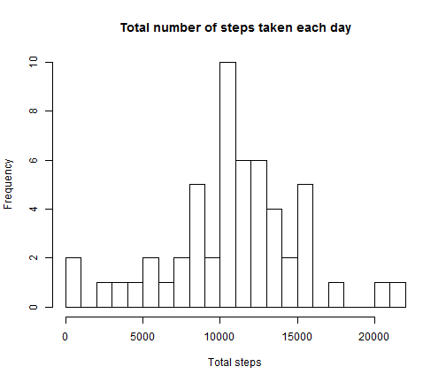
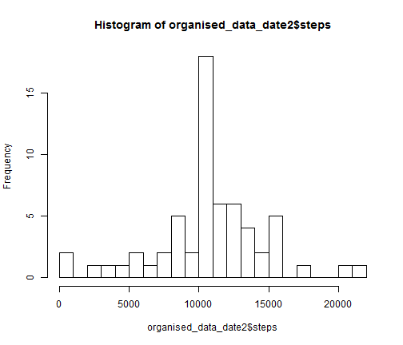
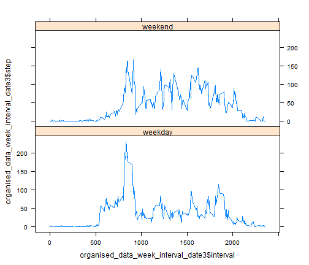

Assignment 1
========================================================

### Loading and preprocessing the data

The data for this assignment can be downloaded from the course web site. The variables included in this dataset are:

-steps: Number of steps taking in a 5-minute interval (missing values are coded as NA)

-date: The date on which the measurement was taken in YYYY-MM-DD format

-interval: Identifier for the 5-minute interval in which measurement was taken

The dataset is stored in a comma-separated-value (CSV) file and there are a total of 17,568 observations in this dataset.


```r
library("reshape2", lib.loc = "D:/Documents/R/win-library/3.0")
library("plyr", lib.loc = "D:/Documents/R/win-library/3.0")
library("lattice", lib.loc = "D:/Documents/R/win-library/3.0")
mydata = read.csv(file = "D:/Downloads/Descargas/repdata_data_activity/activity.csv")
```


### What is mean total number of steps taken per day?

First, the total number of steps taken per day were computed. NA values were ignored, i.e., removed. 


```r
clean_data = mydata[complete.cases(mydata), ]
melted_data <- melt(clean_data, id.vars = c("date", "interval"))
organised_data_date = dcast(melted_data, date ~ variable, fun = sum)
```


An histogram was created to summarize these results.


```r
hist(organised_data_date$steps, nclass = 20, main = "Total number of steps taken each day", 
    xlab = "Total steps")
```

 


The plot shows a distribution approximately centered near 11000.

Finally, the mean and median of the total number os steps per day were calculated.


```r
meanSteps = mean(organised_data_date$steps)
medianSteps = median(organised_data_date$steps)
meanSteps
```

```
## [1] 10766
```

```r
medianSteps
```

```
## [1] 10765
```


We can see that the mean and the median are almost the same and are near 11000, as expected in a normal distribuction. 

### What is the average daily activity pattern?

In order to study the average daily activity pattern, it was ploted the time series of the number of steps taken during each interval, averaged across all days. 


```r
organised_data_interval = dcast(melted_data, interval ~ variable, fun = mean)
plot(organised_data_interval, type = "l")
title("Time series of the mean number of steps")
```

 

```r
organised_data_interval[which.max(organised_data_interval$steps), ]
```

```
##     interval steps
## 104      835 206.2
```


The peak of the time series is at the interval 835, i.e. this interval contains the maximum number of steps. This seems to be by the end of the morning. Also notice that the begining and ending of the series are almost zero, probably corresponding to sleeping time. 

### Imputing missing values

There are a number of days/intervals where there are missing values (coded as NA). The presence of missing days may introduce bias into some calculations or summaries of the data. To study the their impact, the same analysis was repeated, replacing each missing value by the mean for the 5-minute interval where the missing value was.


```r
n = sum(!complete.cases(mydata))
nans = mydata[!complete.cases(mydata), ]
for (i in 1:n) {
    interval = nans[i, 3]
    nans[i, 1] = organised_data_interval[match(interval, organised_data_interval$interval), 
        2]
}
clean_data2 = rbind(nans, clean_data)
clean_data2 = clean_data2[order(clean_data2$date), ]
melted_data2 <- melt(clean_data2, id.vars = c("date", "interval"))
organised_data_date2 = dcast(melted_data2, date ~ variable, fun = sum)
hist(organised_data_date2$steps, nclass = 20)
```

 

```r
meanSteps2 = mean(organised_data_date2$steps)
medianSteps2 = median(organised_data_date2$steps)
meanSteps2
```

```
## [1] 10766
```

```r
medianSteps2
```

```
## [1] 10766
```


The mean value is the same of the one obtained before. The median is slightly different, but the difference is negligible. The distribution also looks as a normal distribuction centered at about 11000. The diffeenc is that it contains more data points.
From these results, we conclude that there is no impact of including missing data on the estimates of the total daily number of steps. However, if the distribuction was not approximatelly normal, the impact could be more significant.

### Are there differences in activity patterns between weekdays and weekends?

The data was sorted according to the day being a weekday or a weekend day. The time series of the number of steps taken during each interval, averaged across all weekdays and weekends were ploted separately. 


```r
clean_data2[, 4] = weekdays(as.Date(clean_data2[, 2]))
clean_data2[, 5] = "weekday"
clean_data2[, 5][grepl("sábado", clean_data2[, 4])] = "weekend"
clean_data2[, 5][grepl("domingo", clean_data2[, 4])] = "weekend"
clean_data2[, 5] = as.factor(clean_data2[, 5])
clean_data2[, 4] = NULL
names(clean_data2) = c("steps", "date", "interval", "week")
melted_data3 = melt(clean_data2, id.vars = c("week", "interval", "date"))
organised_data_week_interval_date3 = dcast(melted_data3, week + interval ~ variable, 
    fun = mean)
xyplot(organised_data_week_interval_date3$step ~ organised_data_week_interval_date3$interval | 
    organised_data_week_interval_date3$week, layout = c(1, 2), type = "l")
```

 


Both series have their peak at about the same location, near the end of the morning. It also looks that during weekends there is more activity during all the day, suggesting that at weekends, since there is no work, there is more time to go outside and/or do excercise.
